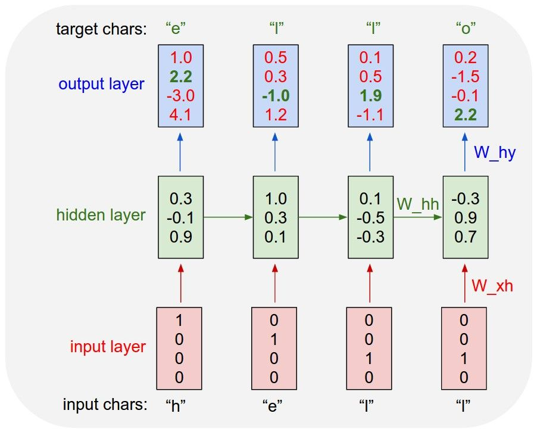
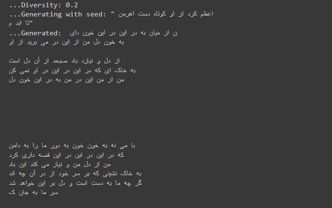

# تولید شعر با شبکه عصبی LSTM و تنسورفلو


یادگیری عمیق ابزاری فوق العاده برای ساخت پروژه های مهیج و سرگرم‌کننده است، هر روز خبری در مورد کاربرد های جدید یادگیری عمیق منتشر میشود و همگان را در تعجب فرو میبرد، آموزش این مدل های جذاب هم در نوع خودش سرگرم‌کننده است مخصوصا مدل های مرتبط به پردازش زبان طبیعی(NLP).


در این ویرگول میخواهم نشان بدهم چگونه میتوان از یادگیری عمیق برای تولید شعر استفاده کنیم، مدلی که خواهیم ساخت، ارتباط بین کارکتر ها را متوجه میشود و احتمال وقوع کارکتر بعدی را محاسبه میکند.


> در این پروژه از شبکه عصبی LSTM استفاده خواهیم کرد. به طور خلاصه، LSTM یک نوع خاص از یک شبکه عصبی RNN است که در پردازش داده هایی که دارای توالی منظم و مرتبط هستند استفاده میشود. مثل متون، موسیقی ها، ویدئو ها و...
> 
> تفاوت RNN ها با شبکه های عصبی کلاسیک داشتن وابستگی زمانی یا اثر حافظه است که داده های قبلی را در حافظه به خاطر میسپارد تا در تصمیم گیری های بعدی استفاده کند.
> 
> [برای مطالعه بیشتر](https://l.vrgl.ir/r?l=https%3A%2F%2Fcolah.github.io%2Fposts%2F2015-08-Understanding-LSTMs%2F&st=post&si=rynq4emx1qcx&k=qToANxWsJZcbp30NlTE%2FGPXPRobbWIVbY2orsTBmE0E%3D)
## آماده سازی
برای شروع به تنسورفلو و نامپای نیاز خواهیم داشت که میتوانید با دستور زیر آنها را نصب کنید :
>pip install -U tensorflow-gpu
>
>pip install -U numpy
ما از دیوان حافظ استفاده میکنیم اما میتوانید برای دقت بیشتر از اشعار سعدی یا فردوسی استفاده کنید(یا هرنوع متن بالای 100 هزار کارکتر)، اشعار حافظ را با دستور زیر دریافت میکنیم :

`wget -O hafez.txt https://raw.githubusercontent.com/amnghd/Persian_poems_corpus/master/normalized/hafez_norm.txt`

ابزار های مورد نیاز را ایمپورت میکنیم و سپس محتوای کتاب را میخوانیم :

```
import tensorflow as tf
import keras
from keras.layers import  Input, LSTM, Dense
import tensorflow.keras.optimizers as optimizers
import numpy as np
import random
text = open(&quothafez.txt&quot, &quotr&quot, encoding=&quotutf-8&quot).read()
```
## پردازش متن و ایجاد دیتاست

شبکه عصبی نمیتواند داده ها به صورت متنی دریافت کند، برای همین باید کارکتر ها را به اعداد صحیح تبدیل کنیم :
```
chars = sorted(list(set(text)))
char_indices = dict((c, i) for i, c in enumerate(chars))
indices_char = dict((i, c) for i, c in enumerate(chars))
```
برای تولید متن مدل با دیدن کارکتر های قبل یاد میگیرد که کارکتر بعدی کدام است :



پس با توجه به تصویر بالا، input ها یک ایندکس از آخر عقب تر از target ها هستند و target ها نیز یک ایندکس از اول جلوتر از input ها هستند، پس به این شیوه متغییر های x و y رو میسازیم:
```
maxlen = 40
step = 3
sentences = []
next_chars = []
for i in range(0, len(text) - maxlen, step):
    sentences.append(text[i : i + maxlen])
    next_chars.append(text[i + maxlen])
x = np.zeros((len(sentences), maxlen, len(chars)), dtype=np.bool)
y = np.zeros((len(sentences), len(chars)), dtype=np.bool)
for i, sentence in enumerate(sentences):
    for t, char in enumerate(sentence):
        x[i, t, char_indices[char]] = 1
    y[i, char_indices[next_chars[i]]] = 1
```
## مدل سازی
حالا میتوانیم مدل LSTM خود را تعریف کنیم. در اینجا از یک لایه LSTM با 128 واحد حافظه به عنوان حافظه پنهان و لایه خروجی یک Dense layer هست که از تابع softmax استفاده میکند، برای بهینه ساز هم از Adam استفاده میکنیم :
```
model = keras.Sequential(
    [
        keras.Input(shape=(maxlen, len(chars))),
        layers.LSTM(128),
        layers.Dense(len(chars), activation=&quotsoftmax&quot),
    ]
)
optimizer = optimizers.Adam(learning_rate=0.01)
model.compile(loss=&quotcategorical_crossentropy&quot, optimizer=optimizer)
```
به دلیل اینکه مدل برای پیش‌بینی کارکتر بعدی، احتمال هر کارکتر را برمیگرداند، یک تابع برای text sampling نیاز خواهیم داشت :
```
def sample(preds, temperature=1.0):
    # helper function to sample an index from a probability array
    preds = np.asarray(preds).astype(&quotfloat64&quot)
    preds = np.log(preds) / temperature
    exp_preds = np.exp(preds)
    preds = exp_preds / np.sum(exp_preds)
    probas = np.random.multinomial(1, preds, 1)
    return np.argmax(probas)
```
و در آخر آموزش مدل را آموزش میدهیم :
```
epochs = 40
batch_size = 128
model.fit(x, y, batch_size=batch_size, epochs=40)
```
آموزش مدل روی NVIDIA Tesla K50 حدود دو دقیقه طول کشید. حالا میتوانیم مدل را تست کنیم :
```
for i in range(10):
    start_index = random.randint(0, len(text) - maxlen - 1)
    for diversity in [0.2, 0.5, 1.0, 1.2]:
        print(&quot...Diversity:&quot, diversity)
        generated = &quot&quot
        sentence = text[start_index : start_index + maxlen]
        print('...Generating with seed: &quot' + sentence + '&quot')
        for i in range(400):
            x_pred = np.zeros((1, maxlen, len(chars)))
            for t, char in enumerate(sentence):
                x_pred[0, t, char_indices[char]] = 1.0
            preds = model.predict(x_pred, verbose=0)[0]
            next_index = sample(preds, diversity)
            next_char = indices_char[next_index]
            sentence = sentence[1:] + next_char
            generated += next_char
        print(&quot...Generated: &quot, generated)
        print()
```
با اجرای کد، ده متن با diversity های مختلف تولید میشود :

## بررسی اشعار تولید شده
> به خاک نشینی که بر سر خود از در آن چه اند
>
> گر چه ما به دست است و دل بر این خواهد شد
^
> ما نگه از دوست ما به در میان بود
>
> به رخسان من و ماه می و مهر ما را
^
> هر که به یاد به باد صبا به میان بود
>
> به خون می کن که زیرکش که من می برد از او
^
> که در دل از او تو به ملامت می برد
>
> تو به پیش کام دل ما نازک سخن بده
^
> از لب گل صفیه و دارد سحر پرده کنم
>
> حافظ ار خاطر و خال ما و ز بر بخت نیک
## بهبود مدل
برای بهبود نتایج مدل چند کار میشه انجام داد :
1. استفاده از مدل پیچیده تر(در اینجا ما فقط از یک لایه LSTM آنهم با 128 واحد حافظه استفاده کرده ایم، استفاده از LSTM های بیشتر و لایه Dropout نتیجه را بهبود میبخشد).
2. متن بهتر(متنی که استفاده کردیم حدود 300 هزار کارکتر داشت، توصیه میشه برای داشتن مدل بهتر از متنی با بیش از یک میلیون کارکتر استفاده شود).
<b style="direction:rtl;margin:auto"> . . . . </b>

نوت بوک این مطلب روی گیت هاب به آدرس زیر موجود است:
## منابع
1. <https://l.vrgl.ir/r?l=https%3A%2F%2Fkeras.io%2Fexamples%2Fgenerative%2Flstm_character_level_text_generation&st=post&si=rynq4emx1qcx&k=zOeyx437OR3QeCv%2FjB2XsCf%2FKnNqtlaItVc2Q19BFN8%3D>
2. <https://l.vrgl.ir/r?l=https%3A%2F%2Fwww.tensorflow.org%2Ftext%2Ftutorials%2Ftext_generation&st=post&si=rynq4emx1qcx&k=Xo01%2F3zx8TbOD5M81Hr6UKoAcHyw2%2BJdd4Nn9ESMbxg%3D>
3. <https://l.vrgl.ir/r?l=https%3A%2F%2Fkarpathy.github.io%2F2015%2F05%2F21%2Frnn-effectiveness%2F&st=post&si=rynq4emx1qcx&k=EziJtl8Ly0STV%2F5NYRTMCZtbkrG7r%2FW42DFNlIUC0nA%3D>
4. Natural Language Processing IN Action, Manning Publication
5. <https://l.vrgl.ir/r?l=https%3A%2F%2Fgithub.com%2Famnghd%2FPersian_poems_corpus&st=post&si=rynq4emx1qcx&k=vqnt5%2F3s7HTiF0xPTRd3SBaWSAgB%2BmuEJlpNoYX5QIU%3D>
